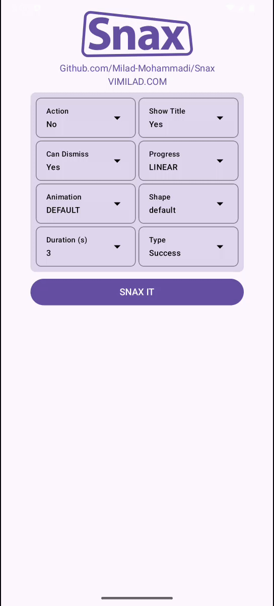

Snax is a powerful and customizable Android Snackbar library built with Jetpack Compose. It offers sleek animations, swipe-to-dismiss functionality, and a variety of styling options to enhance the user experience.

### 🤔 Why Snax?  
Unlike the default Jetpack Compose `Snackbar`, Snax offers:  
- ✅ **No need for `SnackbarHostState`, Place Snax easily in a `Box`** (simplifies usage)  
- 🎭 **Fully Customizable**  
- 🔄 **Actions, swipe-to-dismiss, progress indicators, custom enter/exit transitions**  
- 🎨 **Custom themes, colors, and icons**
- 🏗️ **Easy-to-use API for quick integration**


### Demo
| Action | Title | Dismissable | Progress |
|--------|-------|------------|----------|
|  |  |  |  |

| Animation | Shape | Types |
|-----------|-------|-------|
|  |  |  |


‌‌
‌‌
‌‌
## 📦 Installation
To integrate Snax into your project, add the following dependency to your `build.gradle` (Module-level):
```kts
repositories {
    mavenCentral()
}

dependencies {
  implementation("com.vimilad:Snax:1.0.1")
}
```

‌‌
‌‌
‌‌
## 🛠 Usage
### Initialize Snax State
```kt
val snaxState = rememberSnaxState()
```
### Display a Simple Snackbar
```kt
snaxState.setData(
    type = SnaxType.SUCCESS,
    message = "Your action was successful!"
)
```
### Display a Snackbar with Action
```kt
snaxState.setData(
    type = SnaxType.ERROR,
    message = "Something went wrong!",
    actionTitle = "Retry",
    action = { retryAction() }
)
```

### Integrate with UI
```kt
Box(
    modifier = Modifier
        .fillMaxSize()
        .background(MaterialTheme.colorScheme.background)
        .padding(16.dp)
) {
    Snax(
        state = snaxState,
        modifier = Modifier.align(Alignment.BottomCenter)
    )
}
```
‌‌
‌‌
‌‌
## 🎨 Customize Snax component
```kt
Snax(
    state = snaxState,
    modifier = Modifier.align(Alignment.BottomCenter),
    progressStyle = progressStyle,
    dismissBehavior = DismissBehavior.SWIPE_HORIZONTAL,
    shape = RoundedCornerShape(20.dp),
    animationEnter = slideInVertically(initialOffsetY = { it }) + scaleIn(initialScale = 0.8f),
    animationExit = slideOutVertically(targetOffsetY = { it }) + scaleOut(targetScale = 0.8f),
    duration = 6000L,
    titleStyle = MaterialTheme
        .typography
        .titleLarge
        .copy(
            fontFamily = customFontFamily,
            fontWeight = FontWeight.Bold
        ),
    messageStyle = MaterialTheme
        .typography
        .bodyMedium
        .copy(
            fontFamily = customFontFamily,
            fontWeight = FontWeight.Normal
        ),
    buttonTextStyle = MaterialTheme
        .typography
        .labelLarge
        .copy(
            fontFamily = customFontFamily,
            fontWeight = FontWeight.Medium
        )
)
```

‌‌
‌‌
‌‌
## Show a custom Snax
```kt
snaxState.setData(
    type = SnaxType.CUSTOM(
        icon = R.drawable.ic_custom,
        backgroundColor = Color.Blue,
        overlayColor = Color.Cyan,
        contentColor = Color.White
    ),
    message = "Custom Snackbar!"
)
```

‌‌
‌‌
## 📖 Components & API Reference

| Component | Description |
|-----------|-------------|
| `rememberSnaxState()` | Creates and remembers a `SnaxState` to manage the Snackbar. |
| `SnaxState` | Manages the state and visibility of the Snackbar. |
| `Snax` | Displays a Snackbar with various customization options. |
| `DismissBehavior` | Defines how the Snackbar can be dismissed. |
| `ProgressStyle` | Controls the appearance of the progress indicator. |
| `SnaxType` | Represents different styles of Snackbars. |

### `SnaxState` Methods

| Method | Description |
|--------|-------------|
| `setData(type, message, title, actionTitle, action)` | Updates Snackbar with provided parameters. |

### `Snax` Parameters

| Parameter | Description |
|-----------|-------------|
| `state: SnaxState` | Manages the state of the Snackbar. |
| `modifier: Modifier` | Applies custom styling. |
| `animationEnter: EnterTransition` | Defines enter animation. |
| `animationExit: ExitTransition` | Defines exit animation. |
| `shape: Shape` | Defines the shape of the Snackbar. |
| `progressStyle: ProgressStyle` | Controls progress indicator style. |
| `dismissBehavior: DismissBehavior` | Defines how the Snackbar is dismissed. |
| `titleStyle: TextStyle` | Customizes title text style. |
| `messageStyle: TextStyle` | Customizes message text style. |
| `buttonTextStyle: TextStyle` | Customizes button text style. |
| `duration: Long` | Controls visibility duration. |

### `DismissBehavior` Options

| Option | Description |
|--------|-------------|
| `NOT_DISMISSABLE` | Cannot be dismissed. |
| `SWIPE_HORIZONTAL` | Can be dismissed by swiping. |

### `ProgressStyle` Options

| Option | Description |
|--------|-------------|
| `LINEAR` | Progress bar decreasing from end to start. |
| `SYMMETRIC` | Progress bar is decreasing on both sides. |
| `STATIC` | No animation. |
| `HIDDEN` | No progress indicator. |

### `SnaxType` Options

| Option | Description |
|--------|-------------|
| `SUCCESS` | Success message. |
| `ERROR` | Error message. |
| `INFO` | Informational message. |
| `WARNING` | Warning message. |
| `CUSTOM` | User-defined styling. |


‌‌
‌‌
‌
## 📝 License
This project is licensed under the Apache License 2.0. See the [LICENSE](LICENSE) file for more details.

‌‌
‌‌
‌‌
## 🤝 Contributions
Contributions, issues, and feature requests are welcome! Feel free to check the [issues](https://github.com/Milad-Mohammadi/Snax/issues) page and submit pull requests.

‌‌
‌‌
‌‌
‌
## 📬 Contact
For any inquiries, feel free to reach out via Mohammadi.Dev@gmail.com.

‌‌
‌‌
‌‌
## ©️ Credit
This library is inspired by the [Animated Toast - Fully Editable design on Figma](https://www.figma.com/community/file/1276793899870578167/animated-toast-fully-editable),
